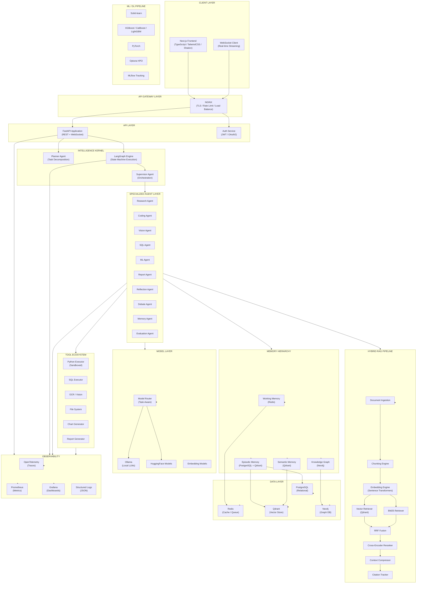
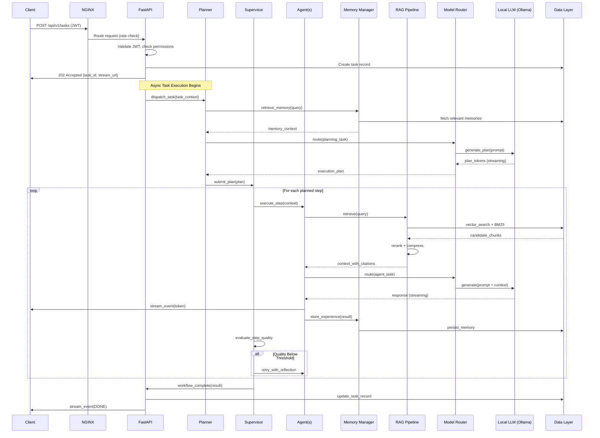
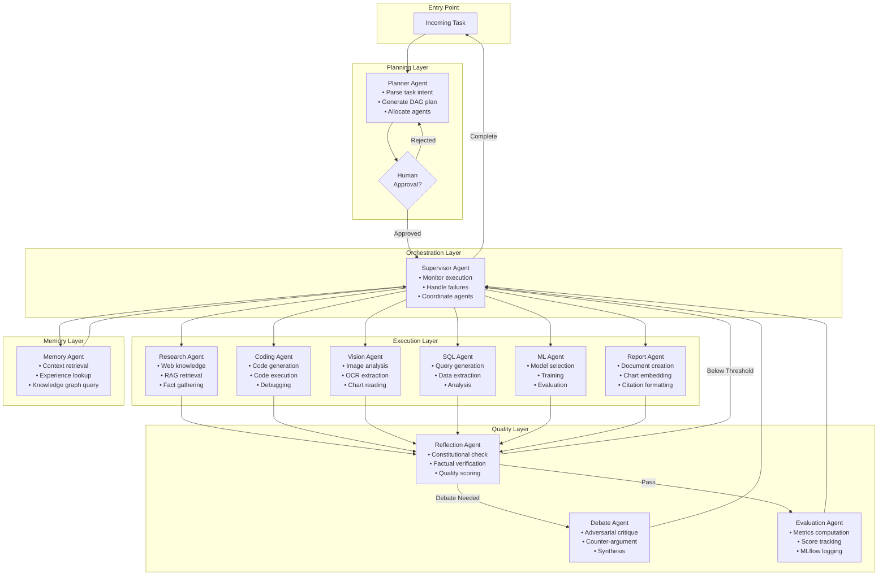
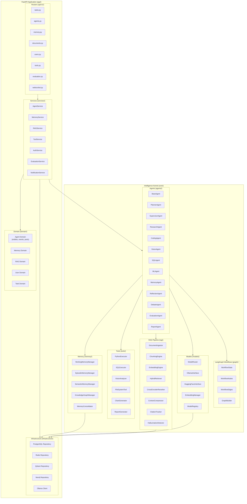

# SECTION 11: HIGH-LEVEL ARCHITECTURE

## System Overview Diagram



## Request Flow Diagram



## Multi-Agent Collaboration Diagram



---

# SECTION 12: LOW-LEVEL ARCHITECTURE

## Component-Level Architecture



---

# SECTION 13: COMPLETE FOLDER STRUCTURE

```
intelligence-os/
│
├── .github/
│   ├── workflows/
│   │   ├── ci.yml                          # Main CI pipeline (lint, test, build)
│   │   ├── cd.yml                          # CD pipeline (staging, prod deploy)
│   │   ├── security.yml                    # Security scanning (Trivy, Bandit, Semgrep)
│   │   ├── dependency-review.yml           # PR dependency audit
│   │   └── release.yml                     # Release automation (changelog, versioning)
│   ├── ISSUE_TEMPLATE/
│   │   ├── bug_report.md
│   │   ├── feature_request.md
│   │   └── agent_behavior.md              # Template for reporting agent quality issues
│   ├── PULL_REQUEST_TEMPLATE.md
│   ├── CODEOWNERS
│   └── dependabot.yml
│
├── docs/
│   ├── adr/                                # Architecture Decision Records
│   │   ├── 0001-qdrant-vs-pinecone.md
│   │   ├── 0002-langgraph-orchestration.md
│   │   ├── 0003-cognitive-memory-hierarchy.md
│   │   ├── 0004-hybrid-rag-strategy.md
│   │   ├── 0005-model-routing-design.md
│   │   ├── 0006-postgres-schema-design.md
│   │   └── 0007-fastapi-clean-architecture.md
│   ├── api/
│   │   └── openapi.yaml                   # Full OpenAPI 3.0 specification
│   ├── architecture/
│   │   ├── high_level.md
│   │   ├── agent_architecture.md
│   │   ├── memory_architecture.md
│   │   ├── rag_architecture.md
│   │   └── deployment_architecture.md
│   ├── development/
│   │   ├── setup.md                       # Local development setup
│   │   ├── contributing.md
│   │   ├── coding_standards.md
│   │   └── testing_guide.md
│   ├── operations/
│   │   ├── deployment.md
│   │   ├── monitoring.md
│   │   ├── incident_response.md
│   │   └── runbooks/
│   │       ├── service_restart.md
│   │       ├── memory_compaction.md
│   │       └── database_backup.md
│   └── research/
│       ├── agent_patterns.md
│       ├── rag_evaluation.md
│       └── memory_consolidation.md
│
├── backend/
│   ├── pyproject.toml                      # Poetry config, dependencies, build settings
│   ├── poetry.lock
│   ├── Makefile                            # Development commands
│   ├── Dockerfile                          # Multi-stage production Dockerfile
│   ├── Dockerfile.dev                      # Development Dockerfile (hot reload)
│   ├── .env.example                        # Environment variable template
│   ├── alembic.ini                         # Alembic migration config
│   │
│   ├── alembic/
│   │   ├── env.py                          # Alembic environment (async-aware)
│   │   ├── script.py.mako
│   │   └── versions/
│   │       ├── 0001_initial_schema.py
│   │       ├── 0002_add_memory_tables.py
│   │       ├── 0003_add_agent_tables.py
│   │       ├── 0004_add_evaluation_tables.py
│   │       ├── 0005_add_audit_tables.py
│   │       └── 0006_add_prompt_versions.py
│   │
│   ├── app/
│   │   ├── __init__.py
│   │   ├── main.py                         # FastAPI application factory; lifespan manager
│   │   │
│   │   ├── api/
│   │   │   ├── __init__.py
│   │   │   ├── dependencies.py             # FastAPI dependency injection (DB, auth, services)
│   │   │   ├── middleware.py               # Request ID, logging, CORS, rate limit middleware
│   │   │   └── v1/
│   │   │       ├── __init__.py
│   │   │       ├── router.py               # Aggregates all v1 routers
│   │   │       ├── tasks.py                # Task submission, status, results
│   │   │       ├── agents.py               # Agent configuration and status
│   │   │       ├── memory.py               # Memory CRUD operations
│   │   │       ├── documents.py            # Document ingestion and management
│   │   │       ├── users.py                # User management
│   │   │       ├── auth.py                 # Login, logout, refresh, OAuth callback
│   │   │       ├── tools.py                # Tool execution and configuration
│   │   │       ├── evaluation.py           # Evaluation results and experiments
│   │   │       ├── models.py               # Model registry and routing config
│   │   │       ├── prompts.py              # Prompt template management
│   │   │       ├── health.py               # Health check endpoints
│   │   │       └── websocket.py            # WebSocket streaming endpoint
│   │   │
│   │   ├── core/
│   │   │   ├── __init__.py
│   │   │   ├── config.py                   # Pydantic Settings (env-driven config)
│   │   │   ├── security.py                 # JWT creation/validation, password hashing
│   │   │   ├── exceptions.py               # Custom exception hierarchy
│   │   │   ├── logging.py                  # Structured JSON logging setup
│   │   │   ├── telemetry.py                # OpenTelemetry initialization and instrumentation
│   │   │   ├── events.py                   # Application lifespan events
│   │   │   └── constants.py                # System-wide constants
│   │   │
│   │   ├── domain/
│   │   │   ├── __init__.py
│   │   │   ├── agent/
│   │   │   │   ├── __init__.py
│   │   │   │   ├── entities.py             # Agent, AgentConfig, AgentCapability value objects
│   │   │   │   ├── events.py               # AgentStarted, AgentCompleted, AgentFailed domain events
│   │   │   │   ├── ports.py                # IAgentRepository, IAgentExecutor interfaces
│   │   │   │   └── exceptions.py           # AgentTimeoutError, AgentPermissionError, etc.
│   │   │   ├── memory/
│   │   │   │   ├── __init__.py
│   │   │   │   ├── entities.py             # Memory, MemoryRecord, KnowledgeTriple value objects
│   │   │   │   ├── events.py               # MemoryCreated, MemoryConsolidated domain events
│   │   │   │   ├── ports.py                # IMemoryRepository, IMemorySearcher interfaces
│   │   │   │   └── exceptions.py
│   │   │   ├── rag/
│   │   │   │   ├── __init__.py
│   │   │   │   ├── entities.py             # Document, Chunk, RetrievalResult, Citation value objects
│   │   │   │   ├── events.py               # DocumentIngested, RetrievalCompleted domain events
│   │   │   │   ├── ports.py                # IDocumentRepository, IRetriever interfaces
│   │   │   │   └── exceptions.py
│   │   │   ├── task/
│   │   │   │   ├── __init__.py
│   │   │   │   ├── entities.py             # Task, ExecutionPlan, TaskStep value objects
│   │   │   │   ├── events.py               # TaskCreated, TaskCompleted domain events
│   │   │   │   ├── ports.py                # ITaskRepository interfaces
│   │   │   │   └── exceptions.py
│   │   │   └── user/
│   │   │       ├── __init__.py
│   │   │       ├── entities.py             # User, Role, Permission value objects
│   │   │       ├── events.py               # UserCreated, RoleAssigned domain events
│   │   │       ├── ports.py                # IUserRepository interfaces
│   │   │       └── exceptions.py
│   │   │
│   │   ├── services/
│   │   │   ├── __init__.py
│   │   │   ├── agent_service.py            # Agent orchestration use cases
│   │   │   ├── memory_service.py           # Memory management use cases
│   │   │   ├── rag_service.py              # Document ingestion and retrieval use cases
│   │   │   ├── task_service.py             # Task lifecycle management
│   │   │   ├── auth_service.py             # Authentication and authorization use cases
│   │   │   ├── user_service.py             # User management use cases
│   │   │   ├── tool_service.py             # Tool execution orchestration
│   │   │   ├── evaluation_service.py       # Evaluation pipeline orchestration
│   │   │   ├── notification_service.py     # WebSocket event broadcasting
│   │   │   └── prompt_service.py           # Prompt template management
│   │   │
│   │   ├── infrastructure/
│   │   │   ├── __init__.py
│   │   │   ├── database/
│   │   │   │   ├── __init__.py
│   │   │   │   ├── session.py              # Async SQLAlchemy session factory
│   │   │   │   ├── base.py                 # Declarative base with audit mixin
│   │   │   │   └── models/
│   │   │   │       ├── __init__.py
│   │   │   │       ├── user.py             # User, Role, Permission ORM models
│   │   │   │       ├── session.py          # Session, Message ORM models
│   │   │   │       ├── task.py             # Task, ExecutionPlan, TaskStep ORM models
│   │   │   │       ├── memory.py           # EpisodicMemory, SemanticMemory ORM models
│   │   │   │       ├── document.py         # Document, Chunk ORM models
│   │   │   │       ├── evaluation.py       # EvaluationRun, Metric ORM models
│   │   │   │       ├── prompt.py           # PromptTemplate, PromptVersion ORM models
│   │   │   │       └── audit.py            # AuditLog ORM model
│   │   │   ├── repositories/
│   │   │   │   ├── __init__.py
│   │   │   │   ├── user_repository.py      # Implements IUserRepository
│   │   │   │   ├── session_repository.py   # Implements ISessionRepository
│   │   │   │   ├── task_repository.py      # Implements ITaskRepository
│   │   │   │   ├── memory_repository.py    # Implements IMemoryRepository (Postgres)
│   │   │   │   ├── document_repository.py  # Implements IDocumentRepository
│   │   │   │   ├── evaluation_repository.py
│   │   │   │   └── prompt_repository.py
│   │   │   ├── redis/
│   │   │   │   ├── __init__.py
│   │   │   │   ├── client.py               # Async Redis client factory
│   │   │   │   ├── working_memory.py       # Working memory Redis operations
│   │   │   │   ├── session_cache.py        # Session state caching
│   │   │   │   ├── llm_cache.py            # LLM response semantic cache
│   │   │   │   └── rate_limiter.py         # Redis-backed sliding window rate limiter
│   │   │   ├── qdrant/
│   │   │   │   ├── __init__.py
│   │   │   │   ├── client.py               # Qdrant async client factory
│   │   │   │   ├── collections.py          # Collection schemas and initialization
│   │   │   │   ├── vector_store.py         # Vector CRUD operations
│   │   │   │   └── search.py               # Hybrid vector + payload search
│   │   │   ├── neo4j/
│   │   │   │   ├── __init__.py
│   │   │   │   ├── driver.py               # Neo4j async driver factory
│   │   │   │   ├── knowledge_graph.py      # Graph CRUD operations
│   │   │   │   └── graph_queries.py        # Cypher query templates
│   │   │   └── external/
│   │   │       ├── __init__.py
│   │   │       ├── ollama_client.py        # Ollama REST client wrapper
│   │   │       ├── huggingface_client.py   # HuggingFace model client
│   │   │       └── oauth_client.py         # OAuth2 provider clients
│   │   │
│   │   └── schemas/
│   │       ├── __init__.py
│   │       ├── requests/                   # Pydantic request models
│   │       │   ├── task.py
│   │       │   ├── memory.py
│   │       │   ├── document.py
│   │       │   ├── user.py
│   │       │   ├── auth.py
│   │       │   └── tool.py
│   │       └── responses/                  # Pydantic response models
│   │           ├── task.py
│   │           ├── memory.py
│   │           ├── document.py
│   │           ├── user.py
│   │           ├── auth.py
│   │           ├── tool.py
│   │           └── evaluation.py
│   │
│   ├── intelligence/
│   │   ├── __init__.py
│   │   │
│   │   ├── agents/
│   │   │   ├── __init__.py
│   │   │   ├── base/
│   │   │   │   ├── __init__.py
│   │   │   │   ├── agent.py               # BaseAgent abstract class
│   │   │   │   ├── context.py             # AgentExecutionContext
│   │   │   │   ├── result.py              # AgentResult, AgentError
│   │   │   │   └── capabilities.py        # Capability enum and registry
│   │   │   ├── planner/
│   │   │   │   ├── __init__.py
│   │   │   │   ├── agent.py               # PlannerAgent implementation
│   │   │   │   ├── prompts.py             # Planner prompt templates
│   │   │   │   ├── parser.py              # Plan output parser
│   │   │   │   └── strategies.py          # Planning strategy variants
│   │   │   ├── supervisor/
│   │   │   │   ├── __init__.py
│   │   │   │   ├── agent.py               # SupervisorAgent implementation
│   │   │   │   ├── prompts.py
│   │   │   │   ├── router.py              # Agent dispatch logic
│   │   │   │   └── monitor.py             # Execution monitoring
│   │   │   ├── research/
│   │   │   │   ├── __init__.py
│   │   │   │   ├── agent.py               # ResearchAgent implementation
│   │   │   │   └── prompts.py
│   │   │   ├── coding/
│   │   │   │   ├── __init__.py
│   │   │   │   ├── agent.py               # CodingAgent implementation
│   │   │   │   ├── prompts.py
│   │   │   │   └── validator.py           # Code validation utilities
│   │   │   ├── vision/
│   │   │   │   ├── __init__.py
│   │   │   │   ├── agent.py               # VisionAgent implementation
│   │   │   │   └── prompts.py
│   │   │   ├── sql/
│   │   │   │   ├── __init__.py
│   │   │   │   ├── agent.py               # SQLAgent implementation
│   │   │   │   ├── prompts.py
│   │   │   │   └── query_builder.py       # Safe query construction
│   │   │   ├── ml/
│   │   │   │   ├── __init__.py
│   │   │   │   ├── agent.py               # MLAgent implementation
│   │   │   │   └── prompts.py
│   │   │   ├── memory_agent/
│   │   │   │   ├── __init__.py
│   │   │   │   ├── agent.py               # MemoryAgent implementation
│   │   │   │   └── prompts.py
│   │   │   ├── reflection/
│   │   │   │   ├── __init__.py
│   │   │   │   ├── agent.py               # ReflectionAgent implementation
│   │   │   │   ├── prompts.py
│   │   │   │   └── constitution.py        # Constitutional AI checklist
│   │   │   ├── debate/
│   │   │   │   ├── __init__.py
│   │   │   │   ├── agent.py               # DebateAgent (Proponent + Critic + Synthesis)
│   │   │   │   └── prompts.py
│   │   │   ├── evaluation_agent/
│   │   │   │   ├── __init__.py
│   │   │   │   ├── agent.py               # EvaluationAgent implementation
│   │   │   │   └── prompts.py
│   │   │   └── report/
│   │   │       ├── __init__.py
│   │   │       ├── agent.py               # ReportAgent implementation
│   │   │       └── prompts.py
│   │   │
│   │   ├── graph/
│   │   │   ├── __init__.py
│   │   │   ├── state.py                   # WorkflowState TypedDict definition
│   │   │   ├── nodes.py                   # LangGraph node implementations
│   │   │   ├── edges.py                   # Conditional edge logic
│   │   │   ├── builder.py                 # Graph construction and compilation
│   │   │   ├── checkpointer.py            # PostgreSQL-backed checkpointing
│   │   │   └── workflows/
│   │   │       ├── __init__.py
│   │   │       ├── research_workflow.py   # Research-focused workflow
│   │   │       ├── coding_workflow.py     # Code generation workflow
│   │   │       ├── analysis_workflow.py   # Data analysis workflow
│   │   │       ├── rag_workflow.py        # RAG question-answering workflow
│   │   │       └── general_workflow.py    # General-purpose workflow
│   │   │
│   │   ├── memory/
│   │   │   ├── __init__.py
│   │   │   ├── manager.py                 # Unified MemoryManager (orchestrates all layers)
│   │   │   ├── working/
│   │   │   │   ├── __init__.py
│   │   │   │   └── manager.py             # WorkingMemoryManager (Redis-backed)
│   │   │   ├── episodic/
│   │   │   │   ├── __init__.py
│   │   │   │   ├── manager.py             # EpisodicMemoryManager
│   │   │   │   └── encoder.py             # Experience record encoder
│   │   │   ├── semantic/
│   │   │   │   ├── __init__.py
│   │   │   │   ├── manager.py             # SemanticMemoryManager (Qdrant-backed)
│   │   │   │   └── importance_scorer.py   # Memory importance scoring
│   │   │   ├── knowledge_graph/
│   │   │   │   ├── __init__.py
│   │   │   │   ├── manager.py             # KnowledgeGraphManager (Neo4j-backed)
│   │   │   │   ├── entity_extractor.py    # NLP entity extraction
│   │   │   │   └── relation_extractor.py  # Relationship extraction
│   │   │   └── consolidator.py            # Memory consolidation scheduler
│   │   │
│   │   ├── rag/
│   │   │   ├── __init__.py
│   │   │   ├── pipeline.py                # Unified RAG pipeline orchestrator
│   │   │   ├── ingestion/
│   │   │   │   ├── __init__.py
│   │   │   │   ├── ingestor.py            # DocumentIngestor (multi-format)
│   │   │   │   ├── loaders/
│   │   │   │   │   ├── pdf_loader.py      # PDF text and image extraction
│   │   │   │   │   ├── docx_loader.py     # DOCX extraction
│   │   │   │   │   ├── html_loader.py     # HTML parsing and extraction
│   │   │   │   │   ├── csv_loader.py      # CSV tabular ingestion
│   │   │   │   │   └── url_loader.py      # URL crawl and extract
│   │   │   │   └── preprocessor.py        # Text cleaning and normalization
│   │   │   ├── chunking/
│   │   │   │   ├── __init__.py
│   │   │   │   ├── engine.py              # ChunkingEngine (strategy selector)
│   │   │   │   ├── recursive_splitter.py  # Recursive character text splitter
│   │   │   │   ├── semantic_splitter.py   # Semantic sentence-based splitter
│   │   │   │   └── sliding_window.py      # Fixed-size sliding window splitter
│   │   │   ├── embedding/
│   │   │   │   ├── __init__.py
│   │   │   │   ├── engine.py              # EmbeddingEngine (model manager)
│   │   │   │   ├── models.py              # Embedding model wrappers
│   │   │   │   └── batch_processor.py     # Efficient batch embedding
│   │   │   ├── retrieval/
│   │   │   │   ├── __init__.py
│   │   │   │   ├── hybrid_retriever.py    # Combines BM25 + vector retrieval
│   │   │   │   ├── bm25_retriever.py      # BM25 sparse retrieval
│   │   │   │   ├── vector_retriever.py    # Dense vector retrieval from Qdrant
│   │   │   │   └── fusion.py              # Reciprocal Rank Fusion
│   │   │   ├── reranking/
│   │   │   │   ├── __init__.py
│   │   │   │   ├── cross_encoder.py       # Cross-encoder reranker
│   │   │   │   └── confidence_scorer.py   # Per-chunk confidence scoring
│   │   │   ├── compression/
│   │   │   │   ├── __init__.py
│   │   │   │   ├── context_compressor.py  # Span extraction and compression
│   │   │   │   └── citation_tracker.py    # Citation chain management
│   │   │   └── evaluation/
│   │   │       ├── __init__.py
│   │   │       ├── hallucination_detector.py  # NLI-based fact verification
│   │   │       └── retrieval_evaluator.py     # NDCG, MRR, Recall@K metrics
│   │   │
│   │   ├── tools/
│   │   │   ├── __init__.py
│   │   │   ├── registry.py                # ToolRegistry with permission enforcement
│   │   │   ├── base.py                    # BaseTool abstract class
│   │   │   ├── python_executor/
│   │   │   │   ├── __init__.py
│   │   │   │   ├── tool.py                # PythonExecutor tool
│   │   │   │   └── sandbox.py             # Execution sandbox implementation
│   │   │   ├── sql_executor/
│   │   │   │   ├── __init__.py
│   │   │   │   └── tool.py                # SQLExecutor tool
│   │   │   ├── vision/
│   │   │   │   ├── __init__.py
│   │   │   │   ├── tool.py                # VisionTool
│   │   │   │   └── ocr.py                 # OCR processing
│   │   │   ├── filesystem/
│   │   │   │   ├── __init__.py
│   │   │   │   └── tool.py                # FileSystemTool (sandboxed)
│   │   │   ├── chart_generator/
│   │   │   │   ├── __init__.py
│   │   │   │   └── tool.py                # ChartGenerator tool (matplotlib/plotly)
│   │   │   └── report_generator/
│   │   │       ├── __init__.py
│   │   │       └── tool.py                # ReportGenerator tool (DOCX/PDF)
│   │   │
│   │   └── models/
│   │       ├── __init__.py
│   │       ├── router.py                  # ModelRouter (task-aware dispatch)
│   │       ├── registry.py                # ModelRegistry (capability profiles)
│   │       ├── ollama/
│   │       │   ├── __init__.py
│   │       │   ├── interface.py           # Ollama model interface
│   │       │   └── models.py              # Supported model definitions
│   │       ├── huggingface/
│   │       │   ├── __init__.py
│   │       │   └── interface.py           # HuggingFace model interface
│   │       └── embedding/
│   │           ├── __init__.py
│   │           ├── manager.py             # EmbeddingModelManager
│   │           └── models.py              # Supported embedding model definitions
│   │
│   ├── ml/
│   │   ├── __init__.py
│   │   ├── pipeline.py                    # ML pipeline orchestrator
│   │   ├── preprocessing/
│   │   │   ├── __init__.py
│   │   │   ├── feature_engineering.py    # Feature extraction and transformation
│   │   │   └── validators.py             # Data schema validation
│   │   ├── training/
│   │   │   ├── __init__.py
│   │   │   ├── trainer.py                # Unified trainer interface
│   │   │   ├── sklearn_trainer.py        # Scikit-learn model training
│   │   │   ├── xgboost_trainer.py        # XGBoost training pipeline
│   │   │   ├── catboost_trainer.py       # CatBoost training pipeline
│   │   │   └── lightgbm_trainer.py       # LightGBM training pipeline
│   │   ├── deep_learning/
│   │   │   ├── __init__.py
│   │   │   ├── trainer.py                # PyTorch training loop
│   │   │   ├── models/
│   │   │   │   ├── __init__.py
│   │   │   │   ├── intent_classifier.py  # Intent classification model
│   │   │   │   └── confidence_scorer.py  # Confidence scoring model
│   │   │   └── datasets/
│   │   │       ├── __init__.py
│   │   │       └── base_dataset.py       # Base PyTorch Dataset
│   │   ├── optimization/
│   │   │   ├── __init__.py
│   │   │   └── optuna_optimizer.py       # Optuna HPO runner
│   │   ├── evaluation/
│   │   │   ├── __init__.py
│   │   │   ├── metrics.py                # Evaluation metrics computation
│   │   │   └── mlflow_tracker.py         # MLflow experiment logging
│   │   └── registry/
│   │       ├── __init__.py
│   │       └── model_registry.py         # MLflow model registry integration
│   │
│   ├── evaluation/
│   │   ├── __init__.py
│   │   ├── pipeline.py                    # Evaluation pipeline orchestrator
│   │   ├── rag_evaluator.py               # RAG retrieval and generation evaluation
│   │   ├── agent_evaluator.py             # Agent behavior evaluation
│   │   ├── hallucination_evaluator.py     # Hallucination rate evaluation
│   │   ├── confidence_evaluator.py        # Confidence calibration evaluation
│   │   └── report_generator.py            # Evaluation report generation
│   │
│   └── prompts/
│       ├── __init__.py
│       ├── manager.py                     # PromptManager (versioning, loading)
│       ├── registry.py                    # Prompt template registry
│       └── templates/
│           ├── agents/
│           │   ├── planner_v1.yaml
│           │   ├── supervisor_v1.yaml
│           │   ├── research_v1.yaml
│           │   ├── coding_v1.yaml
│           │   ├── vision_v1.yaml
│           │   ├── sql_v1.yaml
│           │   ├── ml_v1.yaml
│           │   ├── reflection_v1.yaml
│           │   ├── debate_v1.yaml
│           │   └── evaluation_v1.yaml
│           └── rag/
│               ├── query_expansion_v1.yaml
│               ├── context_compression_v1.yaml
│               └── citation_generation_v1.yaml
│
│   └── tests/
│       ├── __init__.py
│       ├── conftest.py                    # Shared fixtures (DB, Redis, Qdrant mocks)
│       ├── unit/
│       │   ├── __init__.py
│       │   ├── agents/
│       │   │   ├── test_planner.py
│       │   │   ├── test_supervisor.py
│       │   │   ├── test_research.py
│       │   │   ├── test_coding.py
│       │   │   ├── test_reflection.py
│       │   │   └── test_debate.py
│       │   ├── memory/
│       │   │   ├── test_working_memory.py
│       │   │   ├── test_episodic_memory.py
│       │   │   ├── test_semantic_memory.py
│       │   │   └── test_knowledge_graph.py
│       │   ├── rag/
│       │   │   ├── test_chunking.py
│       │   │   ├── test_embedding.py
│       │   │   ├── test_retrieval.py
│       │   │   ├── test_reranking.py
│       │   │   └── test_hallucination.py
│       │   ├── tools/
│       │   │   ├── test_python_executor.py
│       │   │   ├── test_sql_executor.py
│       │   │   └── test_chart_generator.py
│       │   └── models/
│       │       └── test_model_router.py
│       ├── integration/
│       │   ├── __init__.py
│       │   ├── test_rag_pipeline.py       # Full RAG pipeline integration test
│       │   ├── test_agent_workflow.py     # Agent workflow integration test
│       │   ├── test_memory_lifecycle.py   # Memory lifecycle integration test
│       │   ├── test_auth_flow.py          # Authentication flow integration test
│       │   └── test_database.py           # Database repository integration tests
│       ├── e2e/
│       │   ├── __init__.py
│       │   ├── test_task_workflow.py      # Full task submission to completion
│       │   ├── test_document_rag.py       # Document ingestion to RAG response
│       │   └── test_streaming.py          # WebSocket streaming E2E test
│       └── performance/
│           ├── __init__.py
│           ├── locustfile.py              # Locust load testing scenarios
│           └── benchmarks/
│               ├── embedding_benchmark.py
│               └── retrieval_benchmark.py
│
├── frontend/
│   ├── package.json
│   ├── package-lock.json
│   ├── next.config.ts
│   ├── tsconfig.json
│   ├── tailwind.config.ts
│   ├── postcss.config.js
│   ├── .env.local.example
│   ├── Dockerfile
│   │
│   ├── public/
│   │   ├── favicon.ico
│   │   ├── logo.svg
│   │   └── assets/
│   │
│   └── src/
│       ├── app/                           # Next.js App Router
│       │   ├── layout.tsx                 # Root layout (providers, fonts)
│       │   ├── page.tsx                   # Landing/dashboard page
│       │   ├── globals.css
│       │   ├── (auth)/
│       │   │   ├── login/
│       │   │   │   └── page.tsx
│       │   │   └── register/
│       │   │       └── page.tsx
│       │   ├── (dashboard)/
│       │   │   ├── layout.tsx             # Dashboard layout (sidebar, header)
│       │   │   ├── chat/
│       │   │   │   ├── page.tsx           # Main chat interface
│       │   │   │   └── [session_id]/
│       │   │   │       └── page.tsx       # Session-specific chat
│       │   │   ├── tasks/
│       │   │   │   ├── page.tsx           # Task history and management
│       │   │   │   └── [task_id]/
│       │   │   │       └── page.tsx       # Task detail and execution trace
│       │   │   ├── memory/
│       │   │   │   ├── page.tsx           # Memory browser overview
│       │   │   │   ├── episodic/
│       │   │   │   │   └── page.tsx
│       │   │   │   ├── semantic/
│       │   │   │   │   └── page.tsx
│       │   │   │   └── knowledge-graph/
│       │   │   │       └── page.tsx       # Interactive knowledge graph visualizer
│       │   │   ├── documents/
│       │   │   │   ├── page.tsx           # Document library
│       │   │   │   └── upload/
│       │   │   │       └── page.tsx       # Document upload and ingestion
│       │   │   ├── agents/
│       │   │   │   ├── page.tsx           # Agent configuration and status
│       │   │   │   └── [agent_id]/
│       │   │   │       └── page.tsx       # Agent detail and history
│       │   │   ├── evaluation/
│       │   │   │   ├── page.tsx           # Evaluation dashboard
│       │   │   │   └── experiments/
│       │   │   │       └── page.tsx       # MLflow experiment browser
│       │   │   ├── models/
│       │   │   │   └── page.tsx           # Model registry and routing config
│       │   │   ├── prompts/
│       │   │   │   └── page.tsx           # Prompt template editor
│       │   │   ├── monitoring/
│       │   │   │   └── page.tsx           # System monitoring (embedded Grafana)
│       │   │   └── settings/
│       │   │       └── page.tsx           # User and system settings
│       │   └── api/
│       │       └── auth/
│       │           └── [...nextauth]/
│       │               └── route.ts       # NextAuth.js OAuth handler
│       │
│       ├── components/
│       │   ├── ui/                        # Shadcn/ui base components (copied)
│       │   │   ├── button.tsx
│       │   │   ├── input.tsx
│       │   │   ├── dialog.tsx
│       │   │   ├── card.tsx
│       │   │   ├── badge.tsx
│       │   │   ├── table.tsx
│       │   │   ├── tabs.tsx
│       │   │   ├── scroll-area.tsx
│       │   │   ├── tooltip.tsx
│       │   │   └── ...
│       │   ├── chat/
│       │   │   ├── ChatInterface.tsx      # Main chat container
│       │   │   ├── MessageBubble.tsx      # Individual message display
│       │   │   ├── StreamingText.tsx      # Token-by-token text streaming
│       │   │   ├── AgentActivityPanel.tsx # Real-time agent activity sidebar
│       │   │   ├── ToolCallVisualization.tsx  # Tool execution display
│       │   │   ├── CitationPanel.tsx      # RAG citation display
│       │   │   └── MessageInput.tsx       # Input with file upload
│       │   ├── workflow/
│       │   │   ├── WorkflowGraph.tsx      # D3-based workflow DAG visualizer
│       │   │   ├── AgentNode.tsx          # Individual agent node component
│       │   │   ├── ExecutionTimeline.tsx  # Task execution timeline
│       │   │   └── ApprovalGate.tsx       # Human approval UI
│       │   ├── memory/
│       │   │   ├── MemoryBrowser.tsx      # Multi-layer memory browser
│       │   │   ├── KnowledgeGraphViewer.tsx  # Interactive Neo4j graph (D3/Cytoscape)
│       │   │   ├── MemoryCard.tsx         # Individual memory record
│       │   │   └── MemorySearch.tsx       # Cross-layer memory search
│       │   ├── documents/
│       │   │   ├── DocumentUpload.tsx     # Drag-and-drop upload with progress
│       │   │   ├── DocumentCard.tsx       # Document metadata card
│       │   │   ├── ChunkViewer.tsx        # Document chunk browser
│       │   │   └── IngestionStatus.tsx    # Real-time ingestion progress
│       │   ├── evaluation/
│       │   │   ├── MetricsDashboard.tsx   # Evaluation metrics overview
│       │   │   ├── ExperimentTable.tsx    # MLflow experiment table
│       │   │   ├── HallucinationReport.tsx
│       │   │   └── RetrievalQualityChart.tsx
│       │   ├── monitoring/
│       │   │   ├── SystemHealth.tsx       # Service health indicators
│       │   │   ├── MetricsChart.tsx       # Prometheus metric charts
│       │   │   └── AlertPanel.tsx         # Active alert display
│       │   └── layout/
│       │       ├── Sidebar.tsx
│       │       ├── Header.tsx
│       │       ├── Breadcrumb.tsx
│       │       └── ThemeToggle.tsx
│       │
│       ├── hooks/
│       │   ├── useWebSocket.ts            # WebSocket connection management
│       │   ├── useStreamingTask.ts        # Task streaming hook
│       │   ├── useMemory.ts               # Memory operations hook
│       │   ├── useDocuments.ts            # Document management hook
│       │   ├── useAgents.ts               # Agent status hook
│       │   ├── useAuth.ts                 # Authentication hook
│       │   └── useEvaluation.ts           # Evaluation data hook
│       │
│       ├── lib/
│       │   ├── api/
│       │   │   ├── client.ts              # Axios instance with interceptors
│       │   │   ├── tasks.ts               # Task API functions
│       │   │   ├── memory.ts              # Memory API functions
│       │   │   ├── documents.ts           # Document API functions
│       │   │   ├── agents.ts              # Agent API functions
│       │   │   ├── auth.ts                # Auth API functions
│       │   │   └── evaluation.ts          # Evaluation API functions
│       │   ├── utils.ts                   # General utilities
│       │   ├── cn.ts                      # TailwindCSS class merging
│       │   └── constants.ts               # Frontend constants
│       │
│       ├── store/
│       │   ├── auth-store.ts              # Zustand auth state
│       │   ├── chat-store.ts              # Zustand chat/session state
│       │   ├── stream-store.ts            # Zustand streaming state
│       │   └── ui-store.ts                # Zustand UI preferences state
│       │
│       └── types/
│           ├── task.ts
│           ├── memory.ts
│           ├── document.ts
│           ├── agent.ts
│           ├── user.ts
│           ├── evaluation.ts
│           └── websocket.ts
│
├── infrastructure/
│   ├── docker/
│   │   ├── backend.Dockerfile
│   │   ├── frontend.Dockerfile
│   │   ├── nginx.Dockerfile
│   │   └── ollama.Dockerfile
│   │
│   ├── compose/
│   │   ├── docker-compose.yml             # Full production compose
│   │   ├── docker-compose.dev.yml         # Development override
│   │   ├── docker-compose.test.yml        # Testing override
│   │   └── docker-compose.monitoring.yml  # Monitoring stack
│   │
│   ├── nginx/
│   │   ├── nginx.conf                     # Main NGINX configuration
│   │   ├── conf.d/
│   │   │   ├── api.conf                   # API proxy config
│   │   │   ├── frontend.conf              # Frontend proxy config
│   │   │   └── websocket.conf             # WebSocket proxy config
│   │   └── ssl/
│   │       ├── generate_certs.sh          # Self-signed cert generation
│   │       └── .gitkeep
│   │
│   ├── monitoring/
│   │   ├── prometheus/
│   │   │   ├── prometheus.yml             # Prometheus scrape config
│   │   │   └── rules/
│   │   │       ├── agent_alerts.yml
│   │   │       ├── system_alerts.yml
│   │   │       └── rag_alerts.yml
│   │   ├── grafana/
│   │   │   ├── provisioning/
│   │   │   │   ├── datasources/
│   │   │   │   │   └── prometheus.yaml
│   │   │   │   └── dashboards/
│   │   │   │       └── dashboards.yaml
│   │   │   └── dashboards/
│   │   │       ├── ios_overview.json
│   │   │       ├── agent_performance.json
│   │   │       ├── rag_quality.json
│   │   │       ├── memory_operations.json
│   │   │       └── system_resources.json
│   │   └── otel/
│   │       └── otel-collector.yaml        # OpenTelemetry collector config
│   │
│   ├── database/
│   │   ├── postgres/
│   │   │   └── init/
│   │   │       ├── 01_extensions.sql      # pg extensions (uuid-ossp, pg_trgm)
│   │   │       └── 02_roles.sql           # Database roles and permissions
│   │   ├── neo4j/
│   │   │   └── init/
│   │   │       └── constraints.cypher     # Initial graph constraints
│   │   ├── redis/
│   │   │   └── redis.conf                 # Redis configuration
│   │   └── qdrant/
│   │       └── config/
│   │           └── config.yaml            # Qdrant service configuration
│   │
│   └── aws/
│       ├── cloudformation/
│       │   ├── vpc.yaml
│       │   ├── ec2.yaml
│       │   ├── rds.yaml
│       │   └── elasticache.yaml
│       └── scripts/
│           ├── deploy.sh
│           └── rollback.sh
│
├── scripts/
│   ├── setup_dev.sh                       # One-command dev environment setup
│   ├── seed_data.py                       # Database seeding script
│   ├── pull_models.sh                     # Ollama model download script
│   ├── run_tests.sh                       # Full test suite runner
│   ├── generate_migration.sh              # Alembic migration generation helper
│   └── benchmark.py                       # System benchmark runner
│
├── data/
│   ├── sample_documents/                  # Sample documents for testing
│   │   ├── ai_research.pdf
│   │   └── sample_report.docx
│   ├── seed/                              # Database seed data
│   │   ├── users.json
│   │   ├── roles.json
│   │   └── prompts.json
│   └── models/                            # Local model artifacts
│       └── .gitkeep
│
├── .dockerignore
├── .gitignore
├── .env.example
├── README.md                              # Comprehensive project readme
├── CONTRIBUTING.md
├── SECURITY.md
├── CHANGELOG.md
├── LICENSE                                # MIT License
└── Makefile                               # Top-level development commands
```