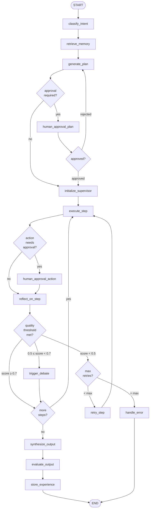

# SECTION 14: BACKEND ARCHITECTURE

## Layered Architecture Overview

IOS backend follows a strict Clean Architecture with four distinct layers that enforce dependency direction (outer layers depend on inner, never reverse):

```
┌─────────────────────────────────────────────────────────┐
│  PRESENTATION LAYER  (FastAPI Routers, WebSocket)        │
│  - HTTP request parsing and response serialization       │
│  - Input validation via Pydantic schemas                 │
│  - Authentication/authorization enforcement              │
│  - Rate limiting enforcement                             │
├─────────────────────────────────────────────────────────┤
│  APPLICATION LAYER  (Services)                           │
│  - Use case orchestration                                │
│  - Transaction boundary management                       │
│  - Domain event publishing                               │
│  - Cross-domain coordination                             │
├─────────────────────────────────────────────────────────┤
│  DOMAIN LAYER  (Entities, Value Objects, Ports)          │
│  - Core business logic                                   │
│  - Domain entities and value objects                     │
│  - Interface definitions (ports)                         │
│  - Domain events                                         │
│  - Zero external dependencies                            │
├─────────────────────────────────────────────────────────┤
│  INFRASTRUCTURE LAYER  (Repositories, Clients)           │
│  - Database repositories implementing domain ports       │
│  - External service clients (Ollama, OAuth)              │
│  - Cache adapters (Redis)                                │
│  - Message queue adapters                                │
└─────────────────────────────────────────────────────────┘
```

## Dependency Injection Pattern

FastAPI's dependency injection system is used throughout IOS to wire infrastructure implementations to domain ports, enabling clean testing through mock substitution:

```
FastAPI Route
  └─ Depends(get_db_session)         → AsyncSession
  └─ Depends(get_current_user)       → User entity
  └─ Depends(get_agent_service)      → AgentService
       └─ AgentService
            ├─ ITaskRepository       ← PostgreSQL implementation
            ├─ IAgentExecutor        ← LangGraph implementation
            └─ INotificationService  ← WebSocket implementation
```

## Request Lifecycle

1. Request arrives at NGINX → TLS termination → rate limit check
2. NGINX proxies to FastAPI application
3. RequestID middleware assigns correlation ID
4. JWT middleware validates token → attaches user context
5. Router extracts path/query/body parameters → validates via Pydantic
6. Route handler calls Service layer use case
7. Service validates business rules → calls Repository/Executor
8. Response serialized via Pydantic response model
9. Middleware attaches response headers (correlation ID, CORS)
10. Structured log emitted with full request context
11. OTel span closed with status

---

# SECTION 15: FRONTEND ARCHITECTURE

## Next.js App Router Architecture

```
app/
├── (auth)/           Server Components - public routes
├── (dashboard)/      Server Components with client islands
│   ├── layout.tsx    Server Component - sidebar, header shell
│   ├── chat/
│   │   └── page.tsx  Server Component → loads ChatInterface (Client)
│   └── ...
└── api/              Next.js API routes (auth callback)
```

## State Management Strategy

| State Type | Solution | Rationale |
|------------|----------|-----------|
| Server state (API data) | TanStack Query | Caching, refetching, optimistic updates |
| Real-time streaming | Zustand stream-store | Atomic updates per token event |
| Auth state | Zustand + cookie | Persistent across tabs |
| UI preferences | Zustand + localStorage | Theme, sidebar state |
| Form state | React Hook Form | Uncontrolled, performant |

## WebSocket Message Protocol

All WebSocket messages from the backend follow a typed event envelope:
```
{
  event_type: "TOKEN" | "AGENT_START" | "AGENT_COMPLETE" | "TOOL_CALL" 
            | "TOOL_RESULT" | "MEMORY_READ" | "RETRIEVAL" | "APPROVAL_REQUIRED" 
            | "ERROR" | "DONE",
  session_id: string,
  task_id: string,
  agent_id: string | null,
  timestamp: ISO8601,
  payload: event-specific object
}
```

## Key Frontend Components

### ChatInterface + StreamingText
The primary user interaction surface. Uses a WebSocket hook that subscribes to task events and incrementally builds the response string via React state, rendering with a token-by-token animation via Framer Motion.

### WorkflowGraph (D3-based)
Renders the active LangGraph execution as a live, animated DAG. Nodes change color based on agent state (pending/active/complete/error). Edges animate when data flows between agents.

### KnowledgeGraphViewer (Cytoscape.js)
Interactive Neo4j graph visualization. Supports zoom, pan, node filtering by type, relationship filtering, and click-to-expand neighbors.

---

# SECTION 16: DATABASE ARCHITECTURE

## PostgreSQL Schema

### Users and Authentication
```sql
-- Core user table
CREATE TABLE users (
    id              UUID PRIMARY KEY DEFAULT gen_random_uuid(),
    email           VARCHAR(255) UNIQUE NOT NULL,
    username        VARCHAR(100) UNIQUE NOT NULL,
    hashed_password VARCHAR(255),              -- NULL for OAuth users
    is_active       BOOLEAN DEFAULT TRUE,
    is_verified     BOOLEAN DEFAULT FALSE,
    created_at      TIMESTAMPTZ DEFAULT NOW(),
    updated_at      TIMESTAMPTZ DEFAULT NOW(),
    last_login_at   TIMESTAMPTZ,
    metadata        JSONB DEFAULT '{}'
);

-- Role definitions
CREATE TABLE roles (
    id          UUID PRIMARY KEY DEFAULT gen_random_uuid(),
    name        VARCHAR(50) UNIQUE NOT NULL,  -- admin, operator, analyst, viewer, api_client
    description TEXT,
    created_at  TIMESTAMPTZ DEFAULT NOW()
);

-- User-role mapping
CREATE TABLE user_roles (
    user_id    UUID REFERENCES users(id) ON DELETE CASCADE,
    role_id    UUID REFERENCES roles(id) ON DELETE CASCADE,
    granted_at TIMESTAMPTZ DEFAULT NOW(),
    granted_by UUID REFERENCES users(id),
    PRIMARY KEY (user_id, role_id)
);

-- Permission definitions
CREATE TABLE permissions (
    id          UUID PRIMARY KEY DEFAULT gen_random_uuid(),
    name        VARCHAR(100) UNIQUE NOT NULL,  -- e.g., "tools:python:execute"
    resource    VARCHAR(50) NOT NULL,           -- e.g., "tools"
    action      VARCHAR(50) NOT NULL,           -- e.g., "execute"
    description TEXT
);

-- Role-permission mapping
CREATE TABLE role_permissions (
    role_id       UUID REFERENCES roles(id) ON DELETE CASCADE,
    permission_id UUID REFERENCES permissions(id) ON DELETE CASCADE,
    PRIMARY KEY (role_id, permission_id)
);

-- OAuth provider accounts
CREATE TABLE oauth_accounts (
    id          UUID PRIMARY KEY DEFAULT gen_random_uuid(),
    user_id     UUID REFERENCES users(id) ON DELETE CASCADE,
    provider    VARCHAR(50) NOT NULL,   -- google, github
    provider_id VARCHAR(255) NOT NULL,
    created_at  TIMESTAMPTZ DEFAULT NOW(),
    UNIQUE(provider, provider_id)
);

-- Refresh tokens
CREATE TABLE refresh_tokens (
    id         UUID PRIMARY KEY DEFAULT gen_random_uuid(),
    user_id    UUID REFERENCES users(id) ON DELETE CASCADE,
    token_hash VARCHAR(255) UNIQUE NOT NULL,
    expires_at TIMESTAMPTZ NOT NULL,
    created_at TIMESTAMPTZ DEFAULT NOW(),
    revoked_at TIMESTAMPTZ,
    ip_address INET,
    user_agent TEXT
);

-- API keys
CREATE TABLE api_keys (
    id          UUID PRIMARY KEY DEFAULT gen_random_uuid(),
    user_id     UUID REFERENCES users(id) ON DELETE CASCADE,
    name        VARCHAR(100) NOT NULL,
    key_hash    VARCHAR(255) UNIQUE NOT NULL,
    last_used_at TIMESTAMPTZ,
    expires_at  TIMESTAMPTZ,
    created_at  TIMESTAMPTZ DEFAULT NOW(),
    revoked_at  TIMESTAMPTZ,
    scopes      TEXT[] DEFAULT '{}'
);
```

### Sessions and Tasks
```sql
-- Conversation sessions
CREATE TABLE sessions (
    id           UUID PRIMARY KEY DEFAULT gen_random_uuid(),
    user_id      UUID REFERENCES users(id) ON DELETE CASCADE,
    title        VARCHAR(255),
    status       VARCHAR(20) DEFAULT 'active',  -- active, archived, deleted
    created_at   TIMESTAMPTZ DEFAULT NOW(),
    updated_at   TIMESTAMPTZ DEFAULT NOW(),
    metadata     JSONB DEFAULT '{}'
);

-- Messages within sessions
CREATE TABLE messages (
    id           UUID PRIMARY KEY DEFAULT gen_random_uuid(),
    session_id   UUID REFERENCES sessions(id) ON DELETE CASCADE,
    role         VARCHAR(20) NOT NULL,   -- user, assistant, system, tool
    content      TEXT NOT NULL,
    tokens       INTEGER,
    created_at   TIMESTAMPTZ DEFAULT NOW(),
    metadata     JSONB DEFAULT '{}'
);
CREATE INDEX idx_messages_session_id ON messages(session_id);
CREATE INDEX idx_messages_created_at ON messages(session_id, created_at);

-- Task definitions
CREATE TABLE tasks (
    id               UUID PRIMARY KEY DEFAULT gen_random_uuid(),
    session_id       UUID REFERENCES sessions(id),
    user_id          UUID REFERENCES users(id) ON DELETE CASCADE,
    title            VARCHAR(500),
    description      TEXT NOT NULL,
    status           VARCHAR(20) DEFAULT 'pending',
                     -- pending, planning, executing, awaiting_approval, complete, failed, cancelled
    priority         INTEGER DEFAULT 5,
    workflow_type    VARCHAR(50),
    created_at       TIMESTAMPTZ DEFAULT NOW(),
    started_at       TIMESTAMPTZ,
    completed_at     TIMESTAMPTZ,
    metadata         JSONB DEFAULT '{}'
);
CREATE INDEX idx_tasks_user_id ON tasks(user_id);
CREATE INDEX idx_tasks_status ON tasks(status);
CREATE INDEX idx_tasks_created_at ON tasks(created_at DESC);

-- Execution plans
CREATE TABLE execution_plans (
    id         UUID PRIMARY KEY DEFAULT gen_random_uuid(),
    task_id    UUID REFERENCES tasks(id) ON DELETE CASCADE UNIQUE,
    plan_graph JSONB NOT NULL,             -- DAG representation
    version    INTEGER DEFAULT 1,
    created_at TIMESTAMPTZ DEFAULT NOW(),
    approved_at TIMESTAMPTZ,
    approved_by UUID REFERENCES users(id)
);

-- Individual task steps
CREATE TABLE task_steps (
    id            UUID PRIMARY KEY DEFAULT gen_random_uuid(),
    task_id       UUID REFERENCES tasks(id) ON DELETE CASCADE,
    plan_id       UUID REFERENCES execution_plans(id),
    step_index    INTEGER NOT NULL,
    agent_type    VARCHAR(50) NOT NULL,
    description   TEXT,
    status        VARCHAR(20) DEFAULT 'pending',
    input_data    JSONB,
    output_data   JSONB,
    error_message TEXT,
    retry_count   INTEGER DEFAULT 0,
    started_at    TIMESTAMPTZ,
    completed_at  TIMESTAMPTZ,
    duration_ms   INTEGER,
    tokens_used   INTEGER,
    UNIQUE(task_id, step_index)
);
CREATE INDEX idx_task_steps_task_id ON task_steps(task_id);

-- Human approval requests
CREATE TABLE approval_requests (
    id           UUID PRIMARY KEY DEFAULT gen_random_uuid(),
    task_id      UUID REFERENCES tasks(id) ON DELETE CASCADE,
    step_id      UUID REFERENCES task_steps(id),
    description  TEXT NOT NULL,
    context      JSONB,
    status       VARCHAR(20) DEFAULT 'pending',  -- pending, approved, rejected
    requested_at TIMESTAMPTZ DEFAULT NOW(),
    resolved_at  TIMESTAMPTZ,
    resolved_by  UUID REFERENCES users(id),
    resolution_notes TEXT
);
```

### Memory Tables
```sql
-- Episodic memory (experience records)
CREATE TABLE episodic_memories (
    id                UUID PRIMARY KEY DEFAULT gen_random_uuid(),
    user_id           UUID REFERENCES users(id) ON DELETE CASCADE,
    session_id        UUID REFERENCES sessions(id),
    task_id           UUID REFERENCES tasks(id),
    task_description  TEXT NOT NULL,
    execution_summary TEXT,
    outcome           VARCHAR(20),  -- success, partial, failure
    quality_score     FLOAT,
    tools_used        TEXT[],
    agents_used       TEXT[],
    tokens_consumed   INTEGER,
    duration_ms       INTEGER,
    tags              TEXT[],
    qdrant_id         UUID,          -- Reference to vector in Qdrant
    created_at        TIMESTAMPTZ DEFAULT NOW(),
    metadata          JSONB DEFAULT '{}'
);
CREATE INDEX idx_episodic_memories_user_id ON episodic_memories(user_id);
CREATE INDEX idx_episodic_memories_created_at ON episodic_memories(created_at DESC);
CREATE INDEX idx_episodic_memories_tags ON episodic_memories USING GIN(tags);

-- Semantic memory records
CREATE TABLE semantic_memories (
    id              UUID PRIMARY KEY DEFAULT gen_random_uuid(),
    user_id         UUID REFERENCES users(id) ON DELETE CASCADE,
    content         TEXT NOT NULL,
    summary         TEXT,
    importance      FLOAT DEFAULT 0.5,    -- 0.0 to 1.0
    access_count    INTEGER DEFAULT 0,
    last_accessed   TIMESTAMPTZ,
    qdrant_id       UUID,                 -- Reference to vector in Qdrant
    source_type     VARCHAR(50),          -- conversation, document, experience
    source_id       UUID,
    tags            TEXT[],
    created_at      TIMESTAMPTZ DEFAULT NOW(),
    updated_at      TIMESTAMPTZ DEFAULT NOW(),
    expires_at      TIMESTAMPTZ
);
CREATE INDEX idx_semantic_memories_user_id ON semantic_memories(user_id);
CREATE INDEX idx_semantic_memories_importance ON semantic_memories(importance DESC);
CREATE INDEX idx_semantic_memories_tags ON semantic_memories USING GIN(tags);
```

### Document and RAG Tables
```sql
-- Document metadata
CREATE TABLE documents (
    id            UUID PRIMARY KEY DEFAULT gen_random_uuid(),
    user_id       UUID REFERENCES users(id) ON DELETE CASCADE,
    filename      VARCHAR(500) NOT NULL,
    title         VARCHAR(1000),
    file_type     VARCHAR(50),
    file_size     BIGINT,
    storage_path  VARCHAR(1000),
    checksum      VARCHAR(64),   -- SHA-256
    status        VARCHAR(20) DEFAULT 'pending',  -- pending, processing, indexed, failed
    page_count    INTEGER,
    word_count    INTEGER,
    language      VARCHAR(10),
    tags          TEXT[],
    created_at    TIMESTAMPTZ DEFAULT NOW(),
    indexed_at    TIMESTAMPTZ,
    metadata      JSONB DEFAULT '{}'
);
CREATE INDEX idx_documents_user_id ON documents(user_id);
CREATE INDEX idx_documents_status ON documents(status);
CREATE INDEX idx_documents_tags ON documents USING GIN(tags);

-- Document chunks
CREATE TABLE document_chunks (
    id            UUID PRIMARY KEY DEFAULT gen_random_uuid(),
    document_id   UUID REFERENCES documents(id) ON DELETE CASCADE,
    chunk_index   INTEGER NOT NULL,
    content       TEXT NOT NULL,
    token_count   INTEGER,
    page_number   INTEGER,
    section_path  TEXT,    -- e.g., "Chapter 2 > Section 3"
    qdrant_id     UUID,    -- Reference to vector in Qdrant
    created_at    TIMESTAMPTZ DEFAULT NOW(),
    UNIQUE(document_id, chunk_index)
);
CREATE INDEX idx_chunks_document_id ON document_chunks(document_id);
```

### Evaluation Tables
```sql
-- Evaluation runs
CREATE TABLE evaluation_runs (
    id               UUID PRIMARY KEY DEFAULT gen_random_uuid(),
    user_id          UUID REFERENCES users(id),
    run_type         VARCHAR(50),   -- rag, agent, hallucination, confidence
    pipeline_version VARCHAR(50),
    status           VARCHAR(20) DEFAULT 'running',
    started_at       TIMESTAMPTZ DEFAULT NOW(),
    completed_at     TIMESTAMPTZ,
    mlflow_run_id    VARCHAR(255),
    summary_metrics  JSONB,
    metadata         JSONB DEFAULT '{}'
);

-- Individual metric records
CREATE TABLE evaluation_metrics (
    id            UUID PRIMARY KEY DEFAULT gen_random_uuid(),
    run_id        UUID REFERENCES evaluation_runs(id) ON DELETE CASCADE,
    metric_name   VARCHAR(100) NOT NULL,
    metric_value  FLOAT NOT NULL,
    step          INTEGER,
    computed_at   TIMESTAMPTZ DEFAULT NOW(),
    context       JSONB
);
CREATE INDEX idx_eval_metrics_run_id ON evaluation_metrics(run_id);
CREATE INDEX idx_eval_metrics_name ON evaluation_metrics(metric_name);
```

### Prompt Version Tables
```sql
-- Prompt templates
CREATE TABLE prompt_templates (
    id          UUID PRIMARY KEY DEFAULT gen_random_uuid(),
    name        VARCHAR(100) UNIQUE NOT NULL,
    description TEXT,
    agent_type  VARCHAR(50),
    created_by  UUID REFERENCES users(id),
    created_at  TIMESTAMPTZ DEFAULT NOW(),
    is_active   BOOLEAN DEFAULT TRUE
);

-- Prompt versions
CREATE TABLE prompt_versions (
    id          UUID PRIMARY KEY DEFAULT gen_random_uuid(),
    template_id UUID REFERENCES prompt_templates(id) ON DELETE CASCADE,
    version     INTEGER NOT NULL,
    content     TEXT NOT NULL,
    variables   JSONB,      -- Variable definitions with types and defaults
    created_by  UUID REFERENCES users(id),
    created_at  TIMESTAMPTZ DEFAULT NOW(),
    is_current  BOOLEAN DEFAULT FALSE,
    notes       TEXT,
    UNIQUE(template_id, version)
);

-- Prompt performance tracking
CREATE TABLE prompt_performance (
    id             UUID PRIMARY KEY DEFAULT gen_random_uuid(),
    version_id     UUID REFERENCES prompt_versions(id) ON DELETE CASCADE,
    task_id        UUID REFERENCES tasks(id),
    quality_score  FLOAT,
    tokens_used    INTEGER,
    latency_ms     INTEGER,
    recorded_at    TIMESTAMPTZ DEFAULT NOW()
);
```

### Audit Table
```sql
-- Immutable audit log
CREATE TABLE audit_logs (
    id          BIGSERIAL PRIMARY KEY,
    user_id     UUID REFERENCES users(id),
    action      VARCHAR(100) NOT NULL,
    resource    VARCHAR(100) NOT NULL,
    resource_id VARCHAR(255),
    ip_address  INET,
    user_agent  TEXT,
    request_id  UUID,
    outcome     VARCHAR(20),   -- success, failure, blocked
    details     JSONB,
    created_at  TIMESTAMPTZ DEFAULT NOW()
) PARTITION BY RANGE (created_at);

-- Monthly partitions (created by automation)
CREATE TABLE audit_logs_2025_01 PARTITION OF audit_logs
    FOR VALUES FROM ('2025-01-01') TO ('2025-02-01');
```

## Neo4j Schema

### Node Labels and Properties
```
(:Entity)               - id, name, type, description, embedding_id, created_at
(:Concept)              - id, name, domain, summary, importance_score, created_at
(:Document)             - id, filename, source_url, ingested_at
(:Person)               - id, name, email, organization, role
(:Organization)         - id, name, domain, description
(:Technology)           - id, name, category, version, description
(:Task)                 - id, title, status, created_at
(:Session)              - id, user_id, created_at
```

### Relationship Types
```
(Entity)-[:RELATED_TO {weight, context}]->(Entity)
(Entity)-[:MENTIONED_IN {page, confidence}]->(Document)
(Concept)-[:SUBTYPE_OF]->(Concept)
(Concept)-[:PREREQUISITE_OF {difficulty}]->(Concept)
(Task)-[:REQUIRES_CONCEPT]->(Concept)
(Task)-[:USES_TECHNOLOGY]->(Technology)
(Person)-[:WORKS_FOR]->(Organization)
(Document)-[:AUTHORED_BY]->(Person)
(Session)-[:DISCUSSED]->(Concept)
(Session)-[:REFERENCED]->(Document)
```

### Initial Constraints (Cypher)
```cypher
CREATE CONSTRAINT entity_id_unique FOR (e:Entity) REQUIRE e.id IS UNIQUE;
CREATE CONSTRAINT concept_id_unique FOR (c:Concept) REQUIRE c.id IS UNIQUE;
CREATE CONSTRAINT document_id_unique FOR (d:Document) REQUIRE d.id IS UNIQUE;
CREATE INDEX entity_name_index FOR (e:Entity) ON (e.name);
CREATE INDEX concept_domain_index FOR (c:Concept) ON (c.domain);
CREATE FULLTEXT INDEX entity_search FOR (e:Entity|Concept) ON EACH [e.name, e.description];
```

## Redis Strategy

### Key Namespacing Convention
```
ios:{env}:{service}:{key_type}:{identifier}

Examples:
ios:prod:session:working_memory:{session_id}
ios:prod:cache:llm_response:{prompt_hash}
ios:prod:cache:embedding:{text_hash}
ios:prod:rate_limit:user:{user_id}
ios:prod:stream:task:{task_id}
ios:prod:lock:agent:{task_id}:{step_id}
ios:prod:approval:pending:{task_id}
```

### Data Structures by Use Case

| Use Case | Redis Type | TTL | Structure |
|----------|-----------|-----|-----------|
| Working memory | Hash | 24 hours | field→value per memory slot |
| Session state | Hash | 1 hour | field→serialized state |
| LLM response cache | String | 1 hour | JSON-serialized response |
| Embedding cache | String | 7 days | Base64-encoded float array |
| Rate limit counter | String + EXPIRE | Sliding window | Integer count |
| Agent execution lock | String + NX | 5 minutes | Lock token |
| Approval pending set | Sorted Set | 24 hours | task_id scored by timestamp |
| Task stream | Stream | 24 hours | Event records |

## Qdrant Collections

### Collection 1: `document_chunks`
```yaml
name: document_chunks
vectors:
  dense:
    size: 1024          # BGE-large-en-v1.5
    distance: Cosine
  sparse:
    modifier: idf       # BM25 sparse vectors
payload_schema:
  document_id: keyword
  chunk_index: integer
  user_id: keyword
  tags: keyword[]
  page_number: integer
  created_at: datetime
  token_count: integer
```

### Collection 2: `semantic_memories`
```yaml
name: semantic_memories
vectors:
  dense:
    size: 1024
    distance: Cosine
payload_schema:
  user_id: keyword
  source_type: keyword
  importance: float
  tags: keyword[]
  created_at: datetime
  expires_at: datetime
```

### Collection 3: `episodic_memories`
```yaml
name: episodic_memories
vectors:
  dense:
    size: 768           # all-mpnet-base-v2 (lower cost for experience encoding)
    distance: Cosine
payload_schema:
  user_id: keyword
  outcome: keyword
  quality_score: float
  tools_used: keyword[]
  agents_used: keyword[]
  created_at: datetime
```

### Collection 4: `entity_embeddings`
```yaml
name: entity_embeddings
vectors:
  dense:
    size: 1024
    distance: Cosine
payload_schema:
  entity_type: keyword
  neo4j_id: keyword
  name: keyword
  domain: keyword
  created_at: datetime
```

---

# SECTION 17: AGENT ARCHITECTURE

## BaseAgent Contract
```
BaseAgent (Abstract)
├── Properties
│   ├── agent_id: UUID
│   ├── agent_type: AgentType enum
│   ├── capabilities: List[Capability]
│   ├── model_preference: ModelPreference
│   ├── max_retries: int
│   ├── timeout_seconds: int
│   └── permission_scope: PermissionScope
├── Abstract Methods
│   ├── execute(context: AgentExecutionContext) → AgentResult
│   └── get_system_prompt() → str
└── Concrete Methods
    ├── run(context) → AgentResult        # Retry + timeout wrapper
    ├── emit_event(event)                 # WebSocket event emission
    ├── log_execution(context, result)    # Structured logging
    └── record_experience(result)         # Experience memory recording
```

## Agent Capability Matrix

| Agent | Planning | Retrieval | Code Exec | SQL | Vision | ML | Memory W/R | Report |
|-------|----------|-----------|-----------|-----|--------|-----|-----------|--------|
| PlannerAgent | ✅ | ✅ | ❌ | ❌ | ❌ | ❌ | R only | ❌ |
| SupervisorAgent | ✅ | ❌ | ❌ | ❌ | ❌ | ❌ | R only | ❌ |
| ResearchAgent | ❌ | ✅ | ❌ | ❌ | ❌ | ❌ | R/W | ❌ |
| CodingAgent | ❌ | ✅ | ✅ | ❌ | ❌ | ❌ | R only | ❌ |
| VisionAgent | ❌ | ❌ | ❌ | ❌ | ✅ | ❌ | R only | ❌ |
| SQLAgent | ❌ | ❌ | ❌ | ✅ | ❌ | ❌ | R only | ❌ |
| MLAgent | ❌ | ✅ | ✅ | ✅ | ❌ | ✅ | R/W | ❌ |
| MemoryAgent | ❌ | ✅ | ❌ | ❌ | ❌ | ❌ | R/W | ❌ |
| ReflectionAgent | ❌ | ✅ | ❌ | ❌ | ❌ | ❌ | R only | ❌ |
| DebateAgent | ❌ | ✅ | ❌ | ❌ | ❌ | ❌ | R only | ❌ |
| EvaluationAgent | ❌ | ❌ | ✅ | ✅ | ❌ | ✅ | R/W | ❌ |
| ReportAgent | ❌ | ✅ | ❌ | ✅ | ✅ | ❌ | R only | ✅ |

## Agent Detailed Specifications

### PlannerAgent
**Responsibility:** Parse incoming task descriptions, retrieve relevant past experiences, generate a structured execution plan as a DAG, and validate plan feasibility.
**Model Preference:** Largest available model (complex reasoning required)
**Key Behaviors:**
- Queries episodic memory for similar past tasks
- Generates plan as structured JSON (dag_nodes, dag_edges, agent_assignments)
- Validates that assigned agents have required capabilities
- Estimates resource requirements (token budget, time budget)
- Presents plan summary for human approval if configured
**Output:** `ExecutionPlan` with DAG structure, agent assignments, step dependencies

### SupervisorAgent
**Responsibility:** Coordinate execution of approved plans, dispatch subtasks to specialized agents, monitor execution progress, handle failures, and produce final synthesized output.
**Model Preference:** Medium-large model (orchestration, not deep reasoning)
**Key Behaviors:**
- Maintains execution state across all active steps
- Dispatches steps to agents in dependency order
- Monitors step timeouts and triggers retries
- Aggregates outputs from multiple agents into coherent result
- Triggers Reflection and Debate agents when quality thresholds require it
- Manages HITL approval gates
**Output:** `WorkflowResult` with aggregated outputs, step trace, quality scores

### ResearchAgent
**Responsibility:** Gather information via hybrid RAG retrieval and synthesize research findings.
**Model Preference:** Medium model with strong instruction following
**Key Behaviors:**
- Expands queries using LLM-powered query expansion
- Executes hybrid retrieval (BM25 + vector)
- Synthesizes findings from multiple retrieved chunks
- Includes in-line citations in output
- Scores confidence of each factual claim
- Flags low-confidence or potentially hallucinated claims
**Output:** `ResearchResult` with findings, citations, confidence scores

### CodingAgent
**Responsibility:** Generate, review, debug, and execute code solutions.
**Model Preference:** Code-specialized model (deepseek-coder, codellama)
**Key Behaviors:**
- Generates code with language-appropriate style
- Validates syntax before execution
- Executes code in sandboxed Python executor
- Interprets execution results and iterates on errors
- Adds inline documentation
- Runs basic security checks on generated code
**Output:** `CodeResult` with code, execution output, test results

### VisionAgent
**Responsibility:** Analyze images, extract text via OCR, interpret charts and diagrams.
**Model Preference:** Vision-capable model (LLaVA, BakLLaVA)
**Key Behaviors:**
- Accepts image file paths or base64-encoded images
- Routes to OCR pipeline for text-heavy images
- Routes to vision LLM for semantic image analysis
- Interprets charts by extracting data points and trends
- Returns structured analysis with confidence scores
**Output:** `VisionResult` with extracted text, analysis, detected objects/charts

### SQLAgent
**Responsibility:** Generate and execute SQL queries, interpret results, and produce data insights.
**Model Preference:** SQL-specialized or general medium model
**Key Behaviors:**
- Inspects target database schema before query generation
- Generates parameterized queries (never string-concatenated)
- Validates queries against permission scope (read-only vs. write)
- Executes queries and formats results as structured data
- Generates natural language interpretation of results
- Suggests visualization for result sets
**Output:** `SQLResult` with query, raw results, column metadata, interpretation

### MLAgent
**Responsibility:** Select appropriate ML algorithms, train models, run hyperparameter optimization, and evaluate results.
**Model Preference:** Medium model with tool-use capability
**Key Behaviors:**
- Analyzes dataset characteristics (size, features, target type)
- Recommends appropriate model family (classification, regression, clustering)
- Configures and runs Optuna HPO within resource budget
- Logs experiments to MLflow
- Returns model performance metrics and feature importances
- Serializes trained models to MLflow registry
**Output:** `MLResult` with model type, metrics, hyperparameters, MLflow run ID

### ReflectionAgent
**Responsibility:** Evaluate agent outputs against a constitutional checklist and provide structured critique.
**Model Preference:** Medium model with strong reasoning
**Key Behaviors:**
- Applies constitutional checklist: factual accuracy, logical consistency, completeness, safety, relevance, citation coverage
- Computes per-criterion score (0.0-1.0)
- Produces overall quality score
- Generates specific, actionable critique for below-threshold outputs
- Triggers rejection if overall score < configured threshold
**Output:** `ReflectionResult` with scores per criterion, overall score, critique, pass/fail

### DebateAgent
**Responsibility:** For contentious or high-stakes outputs, generate adversarial arguments and synthesize balanced conclusion.
**Model Preference:** Large model (complex argumentation required)
**Key Behaviors:**
- Proponent mode: generates strongest supporting arguments for proposed answer
- Critic mode: generates strongest counter-arguments and identifies flaws
- Synthesis mode: integrates both perspectives into nuanced, qualified conclusion
- All three roles can be played by same model instance with different prompts
**Output:** `DebateResult` with proponent_argument, critic_argument, synthesis, confidence

### EvaluationAgent
**Responsibility:** Compute quality metrics for any agent output and log to MLflow.
**Key Behaviors:**
- Computes ROUGE, BERTScore for generation quality
- Computes NDCG, MRR for retrieval quality
- Runs NLI-based hallucination detection
- Logs all metrics to MLflow experiment
- Provides comparative analysis against historical baseline
**Output:** `EvaluationResult` with metric suite, comparison to baseline, MLflow run URL

---

# SECTION 18: LANGGRAPH ARCHITECTURE

## Workflow State Definition

```python
class WorkflowState(TypedDict):
    # Identity
    task_id: str
    session_id: str
    user_id: str
    
    # Task
    task_description: str
    task_intent: str                    # Classified intent
    workflow_type: str                  # research, coding, analysis, general
    
    # Planning
    execution_plan: Optional[ExecutionPlan]
    current_step_index: int
    plan_approved: bool
    
    # Execution
    step_results: Dict[str, AgentResult]
    completed_steps: List[str]
    failed_steps: List[str]
    retry_counts: Dict[str, int]
    
    # Memory
    retrieved_memories: List[MemoryRecord]
    retrieved_context: List[RetrievalResult]
    
    # Quality
    reflection_scores: Dict[str, float]
    debate_triggered: bool
    debate_result: Optional[DebateResult]
    hallucination_flags: List[str]
    
    # Human-in-the-loop
    awaiting_approval: bool
    approval_type: Optional[str]
    approval_context: Optional[Dict]
    
    # Output
    final_output: Optional[str]
    citations: List[Citation]
    evaluation_metrics: Optional[EvaluationMetrics]
    
    # Control
    error: Optional[str]
    abort: bool
    streaming_channel: str
```

## Graph Nodes

### Node: `classify_intent`
**Purpose:** Classify the task into a workflow type to select the appropriate graph path.
**Implementation:** Lightweight ML classifier (trained on task type labels) + fallback LLM classification.
**Output state changes:** `task_intent`, `workflow_type`

### Node: `retrieve_memory`
**Purpose:** Query all memory layers for relevant context before planning.
**Implementation:** Parallel async calls to WorkingMemory (Redis), EpisodicMemory (Qdrant), and KnowledgeGraph (Neo4j).
**Output state changes:** `retrieved_memories`

### Node: `generate_plan`
**Purpose:** PlannerAgent generates the execution plan.
**Implementation:** Calls PlannerAgent.execute() with task description + retrieved memories as context.
**Output state changes:** `execution_plan`

### Node: `human_approval_plan`
**Purpose:** Pause execution and emit APPROVAL_REQUIRED WebSocket event.
**Implementation:** Stores approval request in PostgreSQL; suspends LangGraph via interrupt(); resumes when approval received.
**Output state changes:** `plan_approved`, `awaiting_approval`

### Node: `initialize_supervisor`
**Purpose:** Initialize SupervisorAgent with approved execution plan.
**Output state changes:** None (side effect: creates execution tracking records)

### Node: `execute_step`
**Purpose:** Execute the next step in the plan by dispatching to appropriate specialized agent.
**Implementation:** Supervisor determines next executable step (dependency-ordered); dispatches to agent.
**Output state changes:** `step_results[step_id]`, `current_step_index`, `completed_steps` or `failed_steps`

### Node: `reflect_on_step`
**Purpose:** ReflectionAgent evaluates the last completed step's output.
**Output state changes:** `reflection_scores[step_id]`

### Node: `trigger_debate`
**Purpose:** DebateAgent generates adversarial critique of low-confidence outputs.
**Output state changes:** `debate_result`, `debate_triggered`

### Node: `retry_step`
**Purpose:** Retry a failed or low-quality step with reflection feedback injected into prompt.
**Output state changes:** `retry_counts[step_id]`, re-queues step for execution

### Node: `human_approval_action`
**Purpose:** Pause for human approval before executing high-risk actions (e.g., database writes, file deletions).
**Output state changes:** `plan_approved` for specific step

### Node: `synthesize_output`
**Purpose:** SupervisorAgent aggregates all step outputs into final coherent response.
**Output state changes:** `final_output`, `citations`

### Node: `evaluate_output`
**Purpose:** EvaluationAgent computes quality metrics for final output.
**Output state changes:** `evaluation_metrics`

### Node: `store_experience`
**Purpose:** MemoryAgent persists the task execution as an episodic memory record.
**Output state changes:** None (side effect: memory written)

### Node: `handle_error`
**Purpose:** Log error, emit error event, update task status to failed.
**Output state changes:** `error`, `abort: True`

## Graph Edges and Conditions



## Failure States and Recovery

| Failure Type | Detection | Recovery Strategy |
|-------------|-----------|-------------------|
| Agent timeout | Timeout watchdog | Retry with smaller scope; escalate to supervisor |
| LLM unavailable | HTTP 503 from Ollama | Model router switches to backup model |
| Tool execution error | Exception in tool | Retry with error context; agent reformulates |
| Vector store unavailable | Qdrant connection error | Fall back to BM25-only retrieval |
| Graph DB unavailable | Neo4j connection error | Continue without knowledge graph context |
| Redis unavailable | Redis connection error | Fall back to in-memory working memory |
| Max retries exceeded | Retry counter | Mark step failed; supervisor attempts reroute |
| Workflow abort | User cancellation or critical error | Emit ABORT event; cleanup state; mark task cancelled |

## Checkpointing

IOS implements PostgreSQL-backed LangGraph checkpointing:
- State is serialized to PostgreSQL after every node execution
- Workflow can be resumed from any checkpoint after crash
- Checkpoint retention policy: 72 hours for active tasks, 30 days for completed tasks
- Checkpoint data is encrypted at rest for sessions containing sensitive data